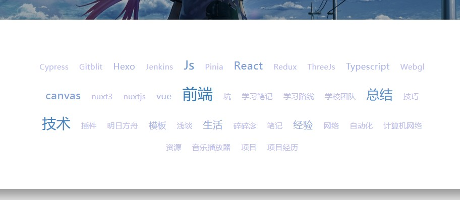

# 开发文档

这个是博客的开发文档，很多接口和事项都在这里注明

博客面向服务端渲染进行制作

技术选型：Astro + Vue3

## BlogConfig

这是博客根目录下的配置文件，搭配 ts 配置说明

### 进度条

使用 Nprogress，不需要转动的小圈圈，可以通过 config 进行设置样式

### 搜索功能

以 Nodejs 为例，将 astro 服务端渲染作为中间件执行，并自行导出搜索接口

## 页面规划

基础页面：

1. 首页
2. 博客 / 归档
3. 标签
4. 友链
5. 关于我
6. 其他页面

## 页面公共组件

### 个人信息

头像：图片路径

文章数量，最后更新时间

一些站点的外链

### 最近文章

一个列表

### 网站信息

一个列表

## 页面明细

### 首页

可以是用户自定义主页，也可以是预设主题，推荐自定义 Astro 组件

主题：一个 `astro` 页面文件，可以从全局状态中取出各种内容

### 博客 / 归档

其对应文章列表

### 标签

标签，使用词云样式，可能需要自主进行开发库

颜色和排版要求：跟 hexo 的 tag 效果差不多就可以了



### 友链

友联列表

### 关于我

markdown 说明

搭配多个自定义模块

自定义模块由一个标题 + 可跳转列表 / 自定义 html 构成

### 其他页面

用户自定义 HTML 进行插入

## 文章页面

文章页面结合 vue 进行开发，选用 `vue3` 或 `petite-vue` 进行处理

petite-vue 文档：https://github.com/vuejs/petite-vue

功能：Markdown 渲染 + 目录实现

目录实现是难点，要求功能：

捕获 Markdown 文章中所有的标题部分

将其处理成 a 标签跳转形式，携带 id，将其处理成如下的数据结构：

```js
const data = [
  {
    title: '一级标题',     // 会展示的 DOM 结构
    active: true,          // 是否激活，即页面是否滚动到当前位置
    id: '一级标题',        // 标题 id，值与 title 相同
    children: [
      {
        // 相同结构
      }
    ]
  }
]
```

监听滚动事件，对每次滚动进行数据结构更新

底部放上近期文章，个人信息的组件，还有许可协议

还有一个需要处理的是图片路径处理，想法是在 markdown 文件夹下建立与文章相同名字的文件夹，里面放上所有静态资源

## 其他功能

### 文章源

从 GitHub issue / Gitee issue 获取文章，不需要自己搭建后台，可以直接进行部署

### 评论源

可选

从 GitHub issue / Gitee issue 获取评论