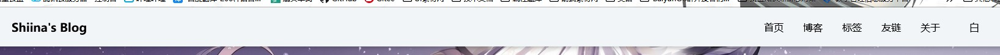
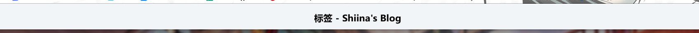
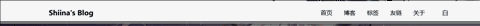
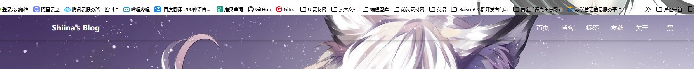

# Header 组件

分两个状态：完整模式和简介模式

完整模式：

简洁模式：

采用上下滚动的方式展示隐藏：

样式：透明和不透明

透明样式：

直接把背景做成透明就行，因为字体会受到全局变量影响，详情见 [实现思路](../实现思路.md) `页面实现思路 -> 通用` 部分

透明模式可以通过 config 进行设置

简洁模式下会附带上当前路由位置的名称，如果是文章页则使用文章名字

文字限制在一行，超出用 `text-overflow: ellipsis;` 处理

右侧菜单需要以下内容：

- 首页，直接跳转
- 博客，直接跳转
- 分类，一个悬浮展示的下拉菜单，下拉菜单内进行跳转
- 标签，直接跳转
- 友联，直接跳转
- 关于，直接跳转
- 其他页面，一个悬浮展示的下拉菜单，下拉菜单内进行跳转
- 搜索按钮，弹出搜索框
- 日间 / 夜间模式切换

移动端样式到时候 @QingXia-Ela 处理

每一个按钮都要有对应的字体图标，资源已经放在 assets/fonts 文件夹下