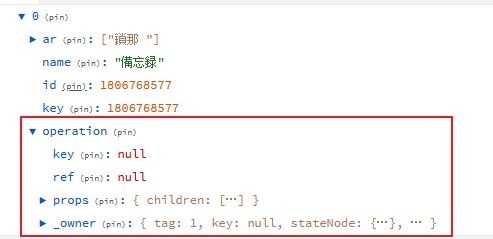

# React制作音乐播放器日记总结-3

## 声明：文章仅为本人总结的经验，不代表这就是正确标准答案

## 控制是否执行替换动画

在 CSS Transition Group 标签中写 key 标签来切换，因为是通过 key 做相同判断标记

```jsx
      <TransitionGroup
        className="h30 por"
        childFactory={(child) => React.cloneElement(child, { classNames: 'info' })}
      >
        <CSSTransition
          key={this.props.currentListId}
          timeout={1200}
          appear={true}
        >
          <div className="top_info">
            {/* code */}
          </div>
        </CSSTransition>
      </TransitionGroup>
```

## nth-child 选择器

使用这个选择器的时候会先找到该元素的父元素，然后在往下一级找相同层级的元素，所以做斑马纹组件的时候可以直接把这种选择器写在组件上

```scss
.black_list_item {
  background-color: #00000088;

  &:nth-child(even).use_zebra {
    background-color: #ffffff10;
  }
}
```

## redux devTools 在特定情况下使得浏览器爆内存的情况

本篇主要是讲这个问题，还挺神奇的，一打开控制台的 redux 开发工具浏览器就爆内存，后面也是碰巧解决了问题，所以想在这里记录一下

### 问题场景

触发的机制是当歌曲播放的时候详细播放列表被打开后，再查看 redux 开发工具时就会出现浏览器内存高占用的情况


此时 redux 开发工具也直接崩溃，换了 chrome 浏览器也是一样

控制台有一句提示：`Application state or actions payloads are too large making Redux DevTools serialization slow and consuming a lot of memory. See link to article on how to configure it.`

跟着链接找到了这里：https://github.com/zalmoxisus/redux-devtools-extension/blob/master/docs/Troubleshooting.md#excessive-use-of-memory-and-cpu

这里是原文：

`That is happening due to serialization of some huge objects included in the state or action. The solution is to sanitize them.`

`You can do that by including/omitting data containing specific values, having specific types... In the example below we're omitting parts of action and state objects with the key data`

`There's a more advanced example on how to implement that for ui-router.`

`The extension is in different process and cannot access the store object directly, unlike vanilla redux-devtools which doesn't have this issue. In case sanitizing doesn't fit your use case, you might consider including it directly as a react component, so there will be no need to serialize the data, but it would add some complexity.`


这里提供的方法是让开发工具省略指定变化内容的抓取，照着整个文档写了一份可行的处理，代码如下

```js
import { combineReducer, applyMiddleware, createStore } from 'redux'
import { composeWithDevTools } from 'redux-devtools-extension'

const combineReducer = combineReducers({
// 你的 reducer
});

const middleware = [reduxThunk];

// 处理 action ， 与下面 state 处理同理
const actionSanitizer = (action: any) => {
  let newAction = { ...action };
  switch (action.type) {
    case CHANGEDETAILSONGLIST:
      newAction.data = 'LONG_DATA';
      break;

    default:
      break;
  }
  return newAction;
};

const composeEnhancers = composeWithDevTools({
  actionSanitizer,
  // 处理 state 此处在每次变化中都把开发工具捕获的 SongList 所有内容给替换成字符串，不影响使用
  stateSanitizer: (state) => {
    let newState: any = {
      ...state,
    };
    newState.SongList = 'Song_list_brief';
    return newState;
  }
});

const enhancers = composeEnhancers(applyMiddleware(...middleware));

export default createStore(combineReducer, enhancers)
```

但是这种方法治标不治本，后续我还是要看 SongList 的 状态，我只好回头检查我里面的哪一项数据特别大，

查了一天后就查到了，在 SongList 列表状态中有一项内容层次特别深，而且都是我没见过的数据



于是就去查是哪里修改了这里的数据


vscode 搜索了一下，只有这一个地方引用了 props 传进来的值，使用的值也是通过 map 遍历返回了一份新的值，但是在新值里面修改后却影响到了原通过 props 传入的全局值，因此怀疑解构赋值并不是深拷贝所有内容，所以把原来解构赋值的方法换成了 `JSON.parse(JSON.stringify())` 这种拷贝方法

```jsx
    let propData = JSON.parse(JSON.stringify(this.props.currentDetailList));
    propData = propData.map((val: any) => {
      val.key = val.id;
      val.ar = val.ar.map((val: any) => `${val.name ? val.name : ''} `);
      val.operation = (
        <Fragment>
          <TransparentButton>
            <PlayCircleOutlined onClick={() => this.props.changeSong(val.id)} />
          </TransparentButton>
          <TransparentButton>
            <DownloadOutlined
              onClick={() => debounce(DownloadAudio, 2000)(val)}
            />
          </TransparentButton>
        </Fragment>
      );
      return val;
    });
```

这个时候那一项内容也一起消失了，对比代码后发现那一项指向的就是两个操作按钮，用的是 React 元素组件作为 key 的值，被转换成对象后里面的所有值也会保留下来，由于内容过多，将内容序列化时消耗了过多内存和 CPU，这便是导致 redux devtools 崩溃的原因

至于为什么只有在播放的时候导致整个开发工具崩溃，个人认为是自己写的 action 在播放音频的时候频繁触发的原因，在音频播放时每秒钟 redux 都会更新当前播放的时间，短时间内 redux 开发工具进行了多次内容处理，导致内存被占满


### 总结

1. 如果要深拷贝对象或者数组时，如果里面没有类似 DOM 元素这种奇怪的内容时，可以选择使用序列化和反序列化这种方式进行拷贝。
2. 解构赋值数组或者对象时如果对应得键值对仍然是对象或者数组化只会将其引用放到新的位置，不会将里面的所有内容一起拷贝
3. Array.map 方法获得的元素仍然是原数组元素中的引用，不是新拷贝的值，对其直接修改会影响到原来的值
4. **千万不要把 DOM 元素往 redux 全局状态里面丢就对了！！**