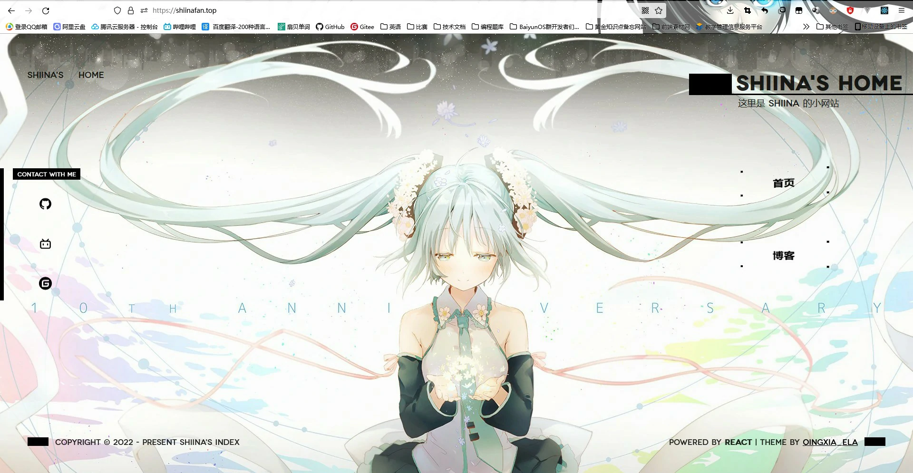
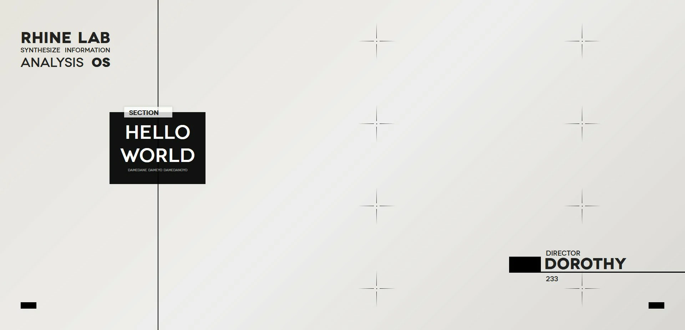
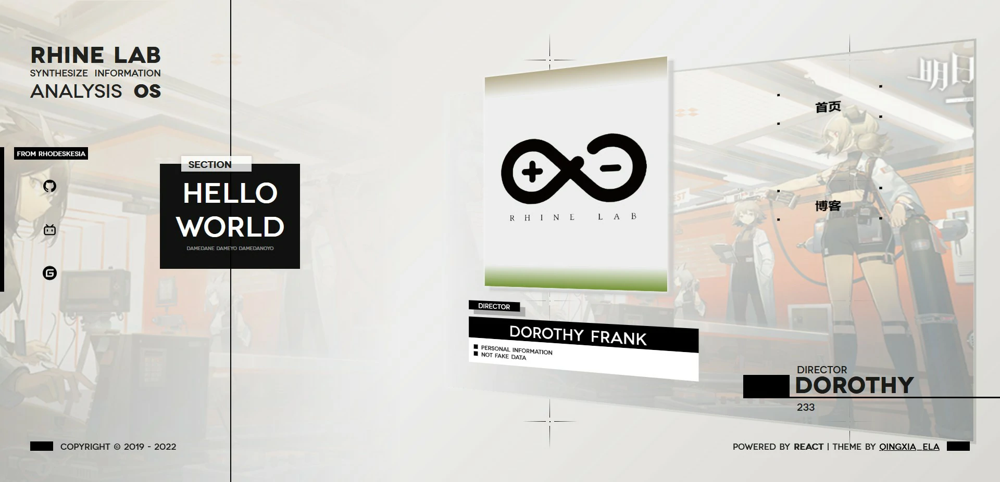
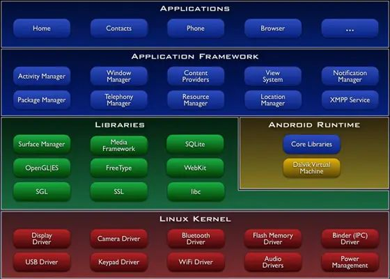
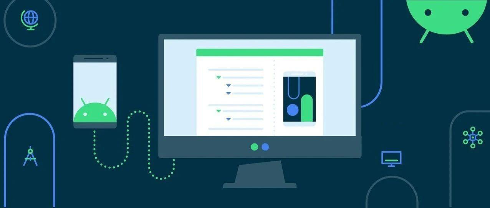

# 团队学习方向介绍

## 前言

团队在本学校提供的功能是 

**`为学有余力的学生提供一个更好的学习学习平台，可以在这里提早学习将来就业 / 考研所需的知识，同时可以在这里认识志同道合的小伙伴一起组队参加比赛或者做项目，为未来的道路铺设稳定的基础`**

本文用于给有意向加入本校团队的新生了解一下团队的各个方向所学习的知识

## 如何加入

请添加微信：`GE2003y , Daisy-170120`

备注团队招新新人

## 方向介绍

### 计算机视觉

主要面向 21 级学生招新，详情链接：https://mp.weixin.qq.com/s/d79eL0vFsendfc2qi65K9g

### 前端

#### 介绍

前端，即网站的前台部分，即我们浏览器访问各种网址所展示出来的页面

工作上来说主要是根据设计图通过前端所使用的几种语言将甲方需求的页面和效果制作出来

核心技术为 `HTML CSS JavaScript` 这三样构成了制作网页的基础

- **HTML**
  这是一种网页的超文本标记语言，他可以构成网页的骨架，是组成网页文字展示的核心与基础
  **下图为本站首页只有 Html 时的样子**
  
- **CSS**
  全名为 `层叠样式表` 用来对网页进行美化，是让网页变得更加美观的基础
  **下图为本站首页添加样式后的样子**
  
- **JavaScript**
  是一种面向 Web 应用开发的脚本语言，他是让网页动起来，可以让网页与用户进行友好交互的基础
  **下面的变化效果为通过 Javascript 控制 CSS 样式所得到的变化效果**
  

  

  

  可以点击这个链接体验上述效果：http://shiinafan.gitee.io/rhine-lab-theme-index-page/

学完以上三样基础我们就可以做个小游戏了，这里有一个贪吃蛇的游戏体验地址，就是使用了以上三种技术写的：https://shiinafan.top/snake

#### 现在动手写下你的第一个网页

可以看看这个视频更加深入地体验前端：[十分钟学会写网页](https://www.bilibili.com/video/BV1hY411j7UM)

#### 总结

目前前端除了制作网页，还包括但不限于各种跨端开发，如当下各种 `小程序` 也是由前端开发人员制作，部分简单的手机 APP 也可以通过前端开发独立完成，前端也可以通过 `electron` 等框架制作桌面应用

### 后端

后端开发工程师主要是负责后端程序的设计开发，涉及服务器、数据库、后端编程语言代码编写等工作。注重于数据的管理和为前端 / App 交互提供数据源

后台的学习会对你的思维逻辑和数据结构与算法有很大的帮助。同时，后台也是市面上较火的方向，就业前景很好，市场平均工资 15k 

你只需要拥有学习的耐心和善于与团队他人交流的勇气，那么你便可以在后端充分体现自己的实力与价值

### 移动端 Android

#### Android开发是什么？

##### Android开发——手机应用程序开发

手机应用程序开发即我们常说的app的开发工作，app开发又细分为3类：

1. 企业应用开发：为企业的硬件产品或专门定制的app应用，如各大手机厂商产品都有旗下的app应用：小米之家，小米智能家居助手等。
2. 通用应用开发：即在市场上为满足用户某项需求而开发的软件，最典型的就是微信，满足日常聊天需求；腾讯新闻app，满足看新闻的需求
3. Android游戏开发：即开发移动端游戏、进行端游移植等。

##### Android开发——Framework层开发

Android中的Framework层开发简单来说就是对Android系统的开发，与应用开发不同的就是涉及到对Android底层原理的开发。一个简单的比喻就是手机应用开发是用Google已经提供给你的工具去做一个app；而Framework层开发就是你要用编程语言去自己做工具，后者要求的技术更高。

总结：目前国内仍然偏向于手机应用程序的开发，较Framework层开发来说，应用程序开发成本小，难度小，市场用户需求大。但Framework层的开发者是招聘中非常稀缺的人才，Framework的知识广泛应用于Android各个领域中，也是进入大厂的很好的敲门砖。（在学习Android过程中可以先从应用开发入手，感受一下Android，然后再细学Framework知识，具体还是要看个人的兴趣）

#### Android的发展前途如何？

##### Android系统的市场前景

手机、平板等移动端用户的激增，为Android系统的广泛应用奠定了庞大的用户基础。目前各大社交终端以及移动媒体中手机占了百分之75.5的比例，随着各种移动端的系统升级、手机用户对移动端游戏画面、内容要求的提升，都推动着对安卓产品的开发力度，并且随着如今日益壮大的安卓手机市场，对于安卓开发者而言，没有愁吃喝的问题，只有忧愁自己胃口是否够大的问题。

##### Android软件开发人员的就业前景

现如今，Android相关的开发人员已经成为5G行业炙手可热的岗位。主要热招职位包括Android开发工程师、Android软件工程师、Android应用开发工程师、系统驱动工程师，Android手机游戏开发、Android系统软件开发、Android程序员、Android游戏应用版本管理、人机交互分析工程师、Android中间层开发工程师等。 Android手机游戏开发工资待遇更是高打平均13936RMB。游戏android也是一个挑战，是一个机遇，而现在只要经过正规摸过培训的Android人员一般都能找到一个不错待遇的工作，一度也成为了现今的高薪职业。android开发未来对于人才知识类储备也会越来越重视，技术越来越严格。选择安卓这条路，在现今就业压力极大的社会背景下也是一个极好的出路，只要学习上进，安卓开发人员在未来的道路发展上具有无限的可能性。

#### Android开发需要学什么？
- Android原生开发

  用JAVA和Kotlin语言调用Android SDK来进行页面、逻辑开发，这种方案是Google官方推出的开发方式，性能最好。

- Flutter开发

  通过Dart语言调用Flutter SDK进行开发。

- H5开发

  在app开发中使用安卓组件WebView打开H5页面，该方案可以充分利用前端生态资源，开发效率非常高，但性能较前两种差。
  
##### 总结

目前Android领域上跨平台的优秀框架非常多，还有用Javascript语言开发的 React Native 框架等。但所有框架开发都离不开Android原生开发，要想学好Android就必须熟悉Android原生开发，随后再结合跨平台框架进行混合开发。

#### 最后
Android开发前途还是不可限量的，剩下的便是只有自己努力去攀登，学习，要掌握正确的学习方法，欢迎大家进入C++团队安卓方向学习，这里有强劲的安卓开发师兄等着你一起探讨Android知识。

### UI

#### UI设计是做什么的？
     * 原型评审和原型优化
     * 熟悉用户体验流程，与产品经理共同迭代产品，打造尖端设计体验
     * 负责视觉实现检查，制定产品界面风格及标准，包括控件、界面图标、交互设计等
     * 如果对于插画设计有一定造诣还能兼职插画师
     简单来说UI设计对软件的人机交互、逻辑手势操作、界面美观的整体设计，即：软件外观的设计师

## 结语

大家可以在暑假的这段时间了解和体验各个方向学习的内容，在开学后团队会统一组织一次宣讲会对各个方向进行更加详细的介绍，更详细的学习路线和学习资源也会一起公布

祝大家学习愉快！