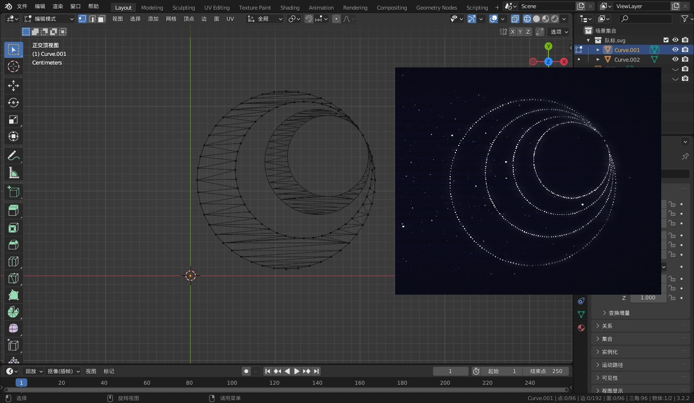
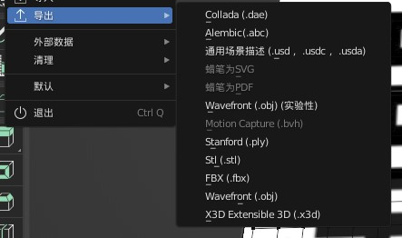
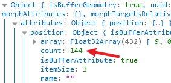
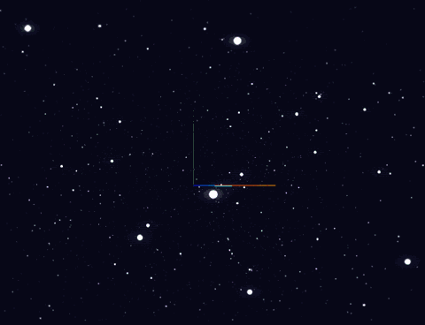
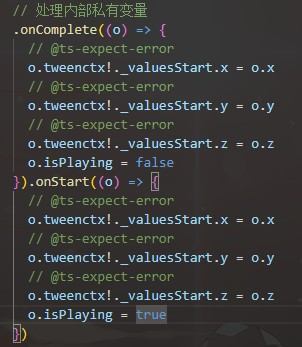

# 基于ThreeJs实现的网页3D粒子效果经验分享

## 前言

本团队在一轮考核过后通过网页的形式发出了一轮考核通过的网页邀请函，其中使用到网页端 3D 粒子技术，是与图灵团队的前端成员进行合作制作的一套模板，并基于模板进行的邀请函制作。

粒子效果想法来源于 **UP2017腾讯互动娱乐年度发布会 - 腾讯互动娱乐**：

https://up.qq.com/act/a20170301pre/index.html# (**需要手动复制粘贴网址才可以正常访问**)

两者的核心技术都是差不多的。本次项目只是在高版本中实现了差不多相同的效果，并将其核心逻辑进行抽离供大家使用

腾讯官方也写了一篇文章针对该技术进行解释：https://tgideas.qq.com/gicp/news/475/6515254.html

粒子效果模板现已开源：
- Github: https://github.com/QingXia-Ela/Up2017-Particles-Effect-Template
- Gitee: https://gitee.com/shiinafan/Up2017-Particles-Effect-Template

项目欢迎提出 Issue 与 PR！

顺在此鸣谢 GitHub 之前的两个类似的项目：
- https://github.com/fangzhioo/threejs-3d-points 开源了页面的反混淆源码
- https://github.com/asdjgfr/TencentUp2017 展示了部分思路

## 简单QA

**Q**: 背景的粒子特效是怎么做到的？
**A**：背景使用的是网页的 Webgl 技术，并使用封装好的 Threejs 渲染库制作。由于 Threejs 版本更新，许多 API 与模型使用方法也都发生了重大变化，所以额外需要花时间进行调整处理。

**Q**: 模型是怎么做的？
**A**：和普通的建模一样，本团队使用 Blender 进行模型建模，直接导出 obj 扩展名的模型进行处理，当然也可以使用其他格式的模型

**Q**: 项目花费的时间？
**A**：项目大概是国庆假期后(2022/10/08)提出来的企划，当时双方团队都有这个需求与意愿，于是在开始了技术探索与尝试，得益于前人的探索与技术分享精神，整个项目的框架完成的比较快，随后便着手于模板的制作，大概 11 月初完成了基本版本的制作。

**Q**: 如果要学习本项目需要先学习的技术栈是啥？
**A**：项目模板使用 `React` + `Typescript` + `Threejs` 进行制作，但是项目核心是纯 Threejs，对于 Threejs 只需要学习了基础即可进行本项目的学习

**Q**: 背景音乐？
**A**：https://www.bilibili.com/video/BV1eW4y1v7ak/?t=63

## 基础制作与遇到的困难

### 总体流程

国庆放完假后我们就同另一个团队成员联系讨论了使用这个粒子效果制作邀请函的想法，因为相对于往届的短信或邮箱的通知模式可能都不够有意思或感受不到团队享受技术氛围？于是就决定合作进行制作与技术讨论。

前期大概是双方团队合作制作，先搭好 React 的脚手架模板并引入相关库，然后试着把核心的粒子变化效果尝试还原出来。后面大概明白了整个流程后就开始了模板的制作，完成后就是双方 UI 团队对各自的邀请函进行页面排版设计，最后交付上线使用。

制作过程还是挺多坑的，下面就一一讲解遇到的坑和解决思路。

### 模型

模型的话是双方团队的成员自行建模，这边的建模需求比较简单，就一个队标和一个波浪还有五个二维码。

队标是 UI 提供的 SVG 图标，然后导入到 Blender 转换为网格然后进行细分操作，勾勒出基本的图案

波浪的话直接用腾讯那个的 json 模型了，这边没有进行处理

二维码的话是进行的平面建模，就单独的平面网格进行勾勒（勾这个就是要耐心，没啥技术含量）

### json 模型的导入

本来以为 json 模型可以正常使用，但是在查阅 Threejs 官方文档的时候发现没有这个 loader 了，后面去 GitHub 上查找的时候才发现这个 JsonLoader 已经被移除了：https://github.com/mrdoob/three.js/pull/15310

可能是 json 模型要被时代抛弃了？这个 PR 是官方开发于 2018 年提出的，而腾讯那个页面是 2017 年的时候制作的，所以应该还有相关依赖。但是我们不想随着让技术因为版本问题而倒退，所以我们决定先使用 `OBJLoader` 加载模型

官方文档：https://threejs.org/docs/index.html?q=obj#examples/zh/loaders/OBJLoader

这反而比较好，因为这边的话 Blender 就有直接导出 obj 模型的选项，原文还是专门安装了插件去将模型处理成 json 格式的

在模板中我们添加了自定义 Loader 选项，这样子就不会强制使用 OBJLoader 去加载模型了，可以选用 GLTF 模型更利于网页加载

源代码：https://github.com/QingXia-Ela/Up2017-Particles-Effect-Template/blob/main/src/THREE/index.ts#L257

建模完成后我们只需要导出物体的网格信息，因为项目本身只需要用到模型的顶点

对于粒子效果，Threejs 有专门的粒子效果系统：[Points](https://threejs.org/docs/index.html#api/zh/objects/Points) 和对应材质：[PointsMaterial](https://threejs.org/docs/index.html#api/zh/materials/PointsMaterial)

### 模型顶点数量在 Threejs 导入后数量不相符

这个问题挺离谱的，我在测试导入模型功能的时候在控制台输出了一下测试用的几何体，一个普通的 2 * 2 正方体导入到场景中有 36 个顶点：

但是通过 threejs 加载器加载后却有 144 个顶点：

这个问题想了一段时间，还拜托了一位会建模的大佬与他进行了一段时间的讨论。

最后认为就是这个数组内有顶点重复，但不太清楚他是怎么算的，直到有一天想不出来时偶然点开了官方的 box 示例，发现了他的网格展示：https://threejs.org/docs/index.html#api/zh/geometries/BoxGeometry

一个点是一个点，两个点组成一个直线，三个点构成一个三角形，而无数个三角形进行组合拼接构成了一个个几何体，那么一个矩形则需要 6 个点进行组合，然后 threejs 是不是对每个面都进行了一次单独计算？

`6 * 4 * 6 === 144`

六个面 * 一个面有四个矩形小面 * 一个小面需要六个顶点组合出来 === 144

也就是说每一个点上其实都有几个点重叠着，那么接下来我们就是要对粒子位置的数组进行去重了，GitHub 提交地址：

https://github.com/QingXia-Ela/Up2017-Particles-Effect-Template/commit/1cf859eaf5b3b22d9cd91e71f05a91cca0382ff3#diff-305a59fd2b370d40622e44cebac59b2846173a4674dc7d6b1931c82f37a23a25

写了个很简单的方法，但是效果很好：

当然这个去重不推荐在其他项目使用，因为其本身是破坏了原有的网格结构，只是本次项目只需要顶点信息，所以比较特殊。

### 粒子动画

基本上是顺延着源文章提出的思想：选出顶点最多的粒子模型，然后根据数量建立一个 Points 实例作为表演的载体，然后导入的每个模型只用于记录顶点位置，并不参与表演。

动画使用的是 [tween.js](https://github.com/tweenjs/tween.js)，之前其实考虑过使用 tweenmax 或者 gsap，但是他们的用法都没有 tween.js 方便，且 tween.js 相对来说更加契合需求，因此还是使用他了。

这一部分的代码是由图灵的同学编写的，但是实际使用的时候掉帧很严重，在本机 GTX1650 的情况下粒子个数在 1w 个的时候只有 30 帧左右，而原页面则是稳定60帧，后面觉得这样子肯定不行，就必须想个办法优化。

原来是这样处理的：https://github.com/QingXia-Ela/turing-invitation/commit/97e97f11bb8bb39068d28fe76f3483d8a94ffa0d#diff-8f8af27a585d7c7c35975ebc22395bdf852d271aa5ed62d456c114d0bb053f90R172-R191

其对源数组建立动画对象，然后直接在数组上进行修改。

但是源代码是在模型对象上面有一个 `vertices` 属性，他是一个数组，直接记录着每个点的 xyz 坐标，原作者是直接对这个进行修改，但是现在新版的 threejs 只有一种 `BufferGeometry` 对象了，他直接用一个数组进行位置信息的记录。

官方文档：https://threejs.org/docs/index.html#api/zh/core/BufferGeometry

所以我猜应该是版本更新把这个给去掉了，那怎么办，那就只好把每个坐标单独进行维护，tween 单独维护坐标的变化，然后通过其坐标变换的回调再调用几何体内置的修改方法改变坐标：https://github.com/QingXia-Ela/Up2017-Particles-Effect-Template/commit/5b43cc91ef0dd6f8a1c0ce117b651ede081b0580#diff-0896a89c5d5bdbbfed755a67988f5fc61284069f3e3857a2f10b701a37a55663R244-R258

运气很好，跟着想法改完后上升到了 55 帧左右，但是还没达到理想的优化状态。

### tween 实例复用

看原文章又提到优化手段是对 tween 实例进行复用，这个不难，用一个数组将所有的 tween 实例存起来，然后每次要用的时候遍历数组对每个实例指定一下终点再启动一下就可以了，但是这个时候就遇到了一个百思不得其解的问题，复用后在切换模型的时候粒子位置出现了问题。

粒子并没有从方块原来的位置移动到指定的地方，而是从最开始的随机位置进行移动，这个问题说实话想了两三天都没想明白，因为自己的代码怎么找都没找到到底是有啥问题，所以最后决定去翻一下插件的源码，是不是插件内对数据进行了一些处理，导致他没按着源数据进行变化。

运气很好，在 tween 的源码中大概半小时就找到了这样一行：

GitHub 原地址：https://github.com/tweenjs/tween.js/blob/main/src/Tween.ts#L172

这一句非常关键，大概意思是说在初始化实例的时候会通过深拷贝的方式将初始值复制到 tween 实例的 `_valueStart` 属性，**但是只拷贝一次**，这就代表着以后每次执行补间时都是从初始值开始，这样也就代表着我们只需要在 tween 执行补间动画期间强制修改 `_valueStart` 的起始值即可。

还好 js 对于对象并没有公有和私有的概念，只是在 ts 上进行了一个判断，如果 js 也有公有私有那估计只能改源码然后弄一个专用的补间库了。随后我在 tween 补间过程和 tween 补间完成的时候进行了一个强制赋值：

这样改的时候 ts 会一直爆红，所以加了忽略错误的注释

到这一步，基本上就已经是稳定丝滑 60 帧了，于是这个时候就开始决定着手制作模板了

### 移动端？

项目并没有优化移动端的想法，因为也不太会，移动端体验的话大概是30帧左右.

如果有移动端移动方法请务必速速提 issue，本人保证**如果方法可行**就会请你吃一顿饭。

## 模板制作与遇到的困难

基本流程都搞懂了接下来就是制作模板了。

模板的介绍看这里：https://gitee.com/shiinafan/Up2017-Particles-Effect-Template/blob/main/README.md

主要讲一些遇到的困难。

### 在模板中实现 KV 动画

本来是没有这个想法的，但是后面做着做着就也有这个需求了，官方的效果如下：

看了一下官方反混淆的源码，发现他的思路是在每个点实例上安插一个 `isPlaying` 的标记，当处于模型切换期间的时候该项为 true，反之为 false，在 false 期间的时候就可以对几何体坐标进行自定义修改。

于是我们在这基础上在模板中导出了 `onAnimationFrameUpdate` 这一个钩子，在每一帧更新的时候均可触发。

模板的预置页面的 `wave` 代码用例如上。

**这个钩子的使用需要特别小心，在某些不可预见的情况下出现的 bug 可能是因为这个钩子的代码没有合理编写！**

### 顶点信息双向绑定

前文提到 tween 控制的补间与几何体顶点数据数组是分开控制的，而且前面只完成了 tween 更新时对几何体数组控制的单向绑定，而在这个钩子进行更新的的时候却没有对 tween 内的顶点信息进行更新，需要在函数内进行手动更新。因此后面我决定试着进行内部更新。

相关代码：
https://github.com/QingXia-Ela/Up2017-Particles-Effect-Template/commit/76b32e7340b1563574c86ce6bae7328b5d7d3c25#diff-0896a89c5d5bdbbfed755a67988f5fc61284069f3e3857a2f10b701a37a55663R372-R374

这样就不需要手动在钩子内进行同步了。

### 自动更新标记

同理，还有一个更新 `BufferAttributes` 的功能。

官方文档：https://threejs.org/docs/index.html#api/zh/core/BufferAttribute.needsUpdate

我的想法是在 `onAnimationFrameUpdate` 钩子函数内返回一个 true 来触发自动更新，这样子可控制的灵活性更高。

相关代码：
https://github.com/QingXia-Ela/Up2017-Particles-Effect-Template/commit/76b32e7340b1563574c86ce6bae7328b5d7d3c25#diff-0896a89c5d5bdbbfed755a67988f5fc61284069f3e3857a2f10b701a37a55663R467-R474

## 结语

这个项目从构想到上线模板大约一个月时间，其中不乏各种千奇古怪的 bug 与细节，本文没有一一列出，因为可能看了也学不到什么。

项目作为 threejs 入门的项目我个人觉得还是挺不错的，因为没有涉及到复杂的动作交互与场景切换。

移动端以及细节优化还是挺高深的，这个以后可能有时间会继续了解。

再次感谢积极参与到本项目的双方团队队员，你们都是最强的！